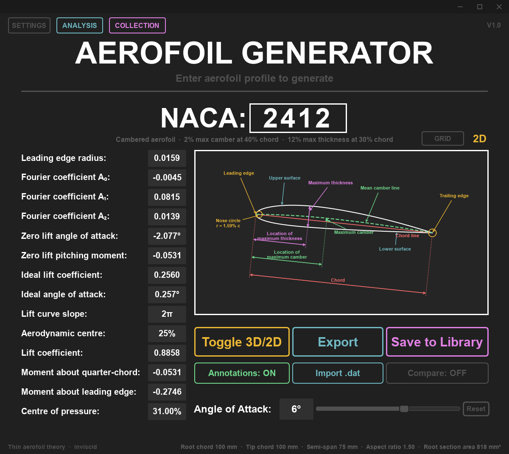
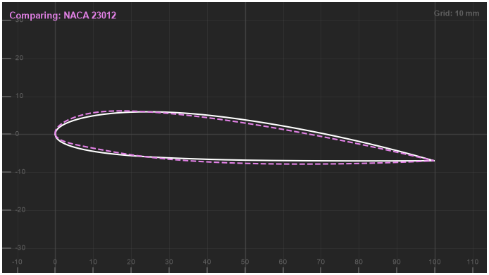
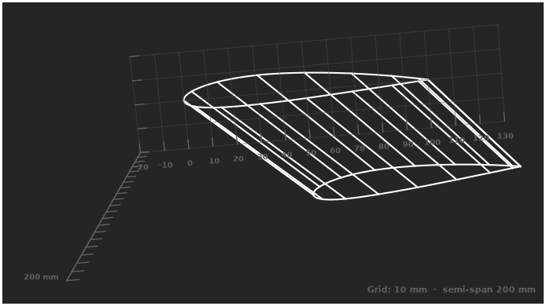
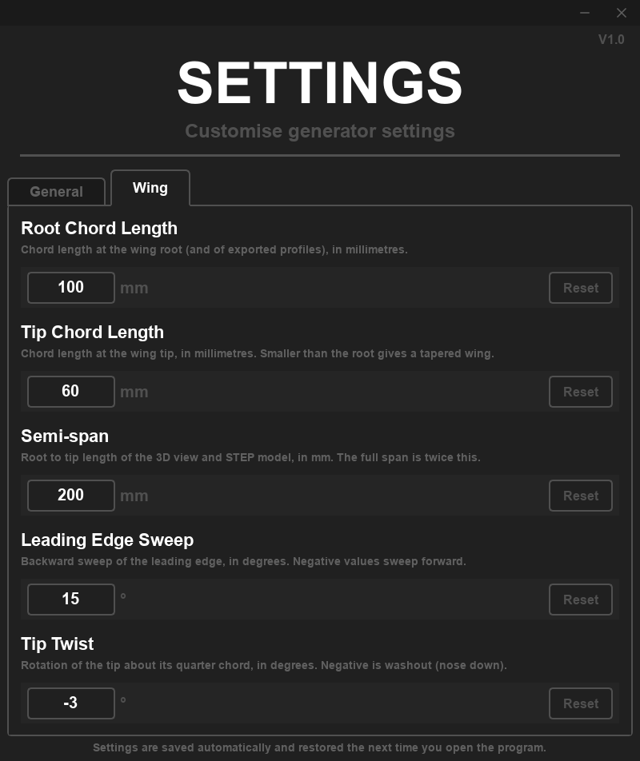
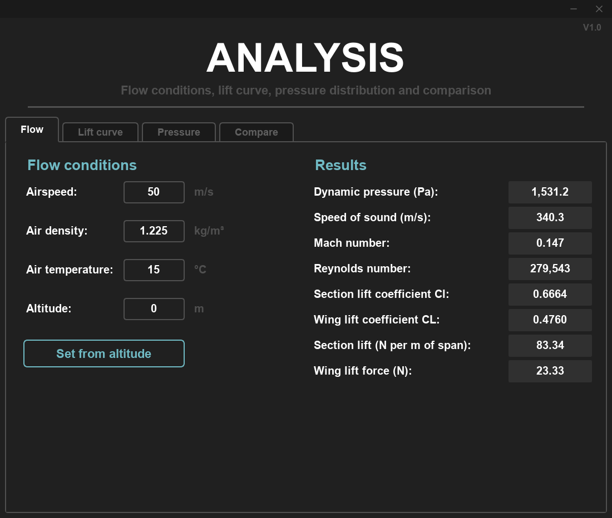
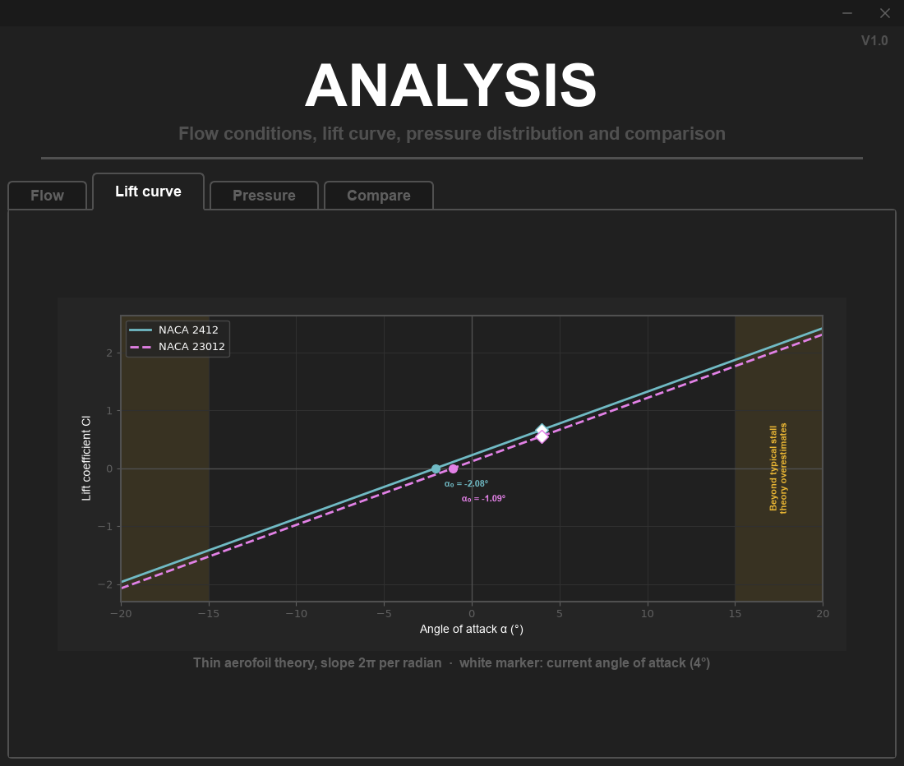
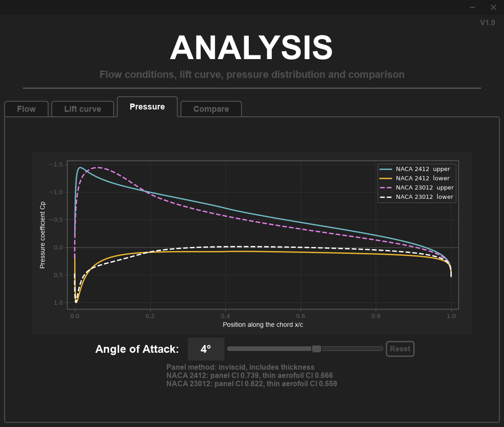
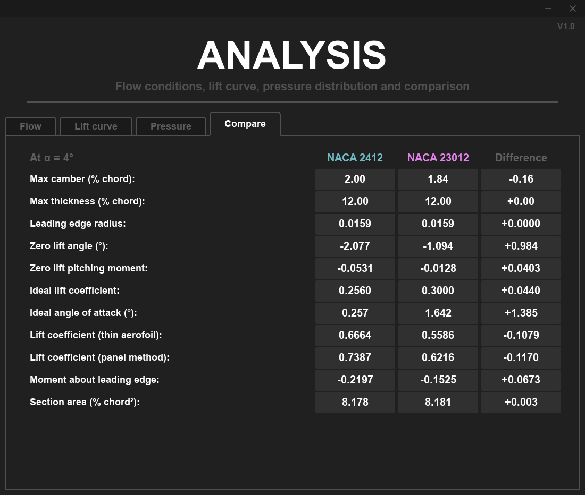
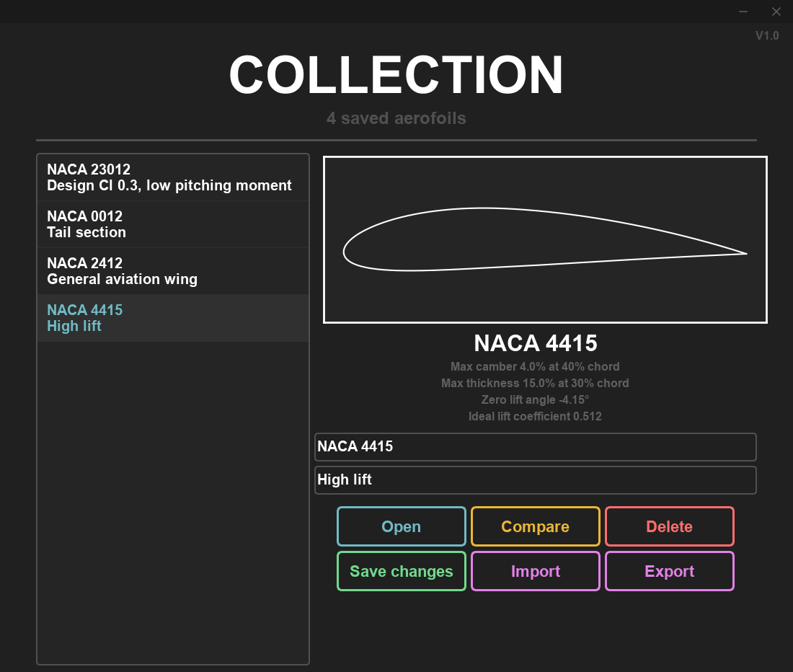
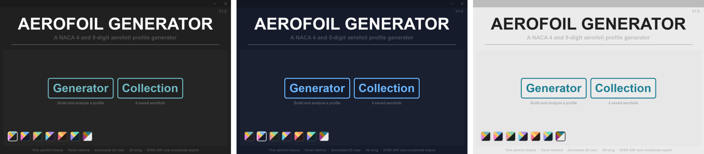

# Aerofoil Generator

A desktop application for generating, analysing and exporting NACA 4 and 5-digit aerofoils, built with
PySide6, NumPy and Matplotlib.

Type a NACA code to get the profile, its thin aerofoil theory results and an annotated 2D view. You can then
look at a tapered, swept and twisted 3D wing, check the pressure distribution with a panel method, compare
two sections, and export the result as a STEP solid, a DXF sketch or a coordinate file.



## Features

### Generate any NACA 4 or 5-digit section

- **4-digit and 5-digit sections**, including reflex camber 5-digit sections (third digit 1), with a plain
  English description of each code as you type it
- **Thin aerofoil theory results update live:** Fourier coefficients A₀ to A₂, zero lift angle, quarter chord
  pitching moment, ideal lift coefficient and angle, lift coefficient, leading edge moment and centre of
  pressure
- **Annotated 2D view** (shown above) labelling the chord, camber line, maximum thickness and camber, and the
  nose circle. Everything rotates with the angle of attack slider, and a warning appears past a typical stall
  angle
- **Imported profiles** in Selig or Lednicer `.dat` format, e.g. from the
  [UIUC Airfoil Coordinates Database](https://m-selig.ae.illinois.edu/ads/coord_database.html), get the same
  analysis as NACA sections

### Compare sections at real size

Overlay any aerofoil from your collection on the current one, with a millimetre grid that shows the real
size of the exported part. Here a NACA 2412 (white) is compared with a NACA 23012 (pink) at 4°:

<p align="center"></p>

### Design a 3D wing

Set the root and tip chords, semi-span, leading edge sweep and tip twist, and the 3D wireframe updates to
match. The view fits itself to the frame, and the mouse wheel zooms. The grid and the ruler along the span
are in millimetres.

<p align="center">
  
  
</p>

### Analyse it

The analysis window has four tabs, and all of them follow the angle of attack and the comparison aerofoil
from the generator:

| | |
|---|---|
|  |  |
| **Flow:** airspeed, density and temperature (or fill them in from an altitude using the International Standard Atmosphere) give the dynamic pressure, Mach and Reynolds numbers, and the section and whole-wing lift | **Lift curve:** Cl against angle of attack for both aerofoils, with their zero lift angles, the current angle and the typical stall region marked |
|  |  |
| **Pressure:** Cp on the upper and lower surfaces from a Hess-Smith panel method, which includes thickness, with its lift coefficient next to the thin aerofoil value | **Compare:** every result for the two aerofoils side by side, with the difference |

### Export it

- **STEP solid** of the wing, built from B-spline surfaces, which opens in SolidWorks, Fusion 360, FreeCAD and
  other CAD packages
- **DXF sketch** of the profile as a closed polyline in millimetres
- **Coordinates** as a Selig `.dat` file or a `.csv` spreadsheet
- **Image** of the current 2D or 3D view as a PNG or SVG

### Keep a collection

Save aerofoils with a name and notes, open or compare any of them in one click, and export the whole
collection to a file to back it up or share it.

<p align="center"></p>

### Pick a theme

Seven colour themes, chosen on the start window and applied live to every open window. The program remembers
your choice.



## Getting started

Python 3.10 or newer is needed.

```bash
git clone https://github.com/Albie-Hardy77/Aerofoil-Generator
cd Aerofoil-Generator
python -m venv .venv
.venv\Scripts\activate          # Windows
source .venv/bin/activate       # macOS / Linux
pip install -r requirements.txt
python src/Main.py
```

Settings, the theme, flow conditions and your collection are saved in a `src/aerofoil_data` folder, which is
created the first time something is saved.

## Theory and conventions

These are the choices that affect the numbers. They're stated here so the results can be checked against
a textbook.

**Geometry**
- The NACA thickness distribution uses a last coefficient of −0.1036 instead of the original −0.1015, so the
  trailing edge closes to zero thickness. This is the usual modification for CAD and panel methods.
- 5-digit camber lines use the standard tabulated m and k₁ (and k₂/k₁ for reflex sections) for a design
  lift coefficient of 0.3, with k₁ scaled linearly for other first digits (design Cl = 0.15 × first digit).
- Points are cosine spaced, so they cluster at the leading and trailing edges.

**Imported profiles**
- Points are normalised so the chord runs from the leading edge, taken as the point on the nose farthest from
  the trailing edge, to the trailing edge at (1, 0). For a cambered NACA section this isn't exactly where the
  NACA camber line starts, so re-importing an exported NACA 4415 reads about 3.7% camber and a zero lift
  angle about 0.2° smaller. That comes from the chord definition, not from a loss of accuracy.
- The camber line of an imported profile is the mean of the upper and lower surfaces at each x.

**Aerodynamics**
- Thin aerofoil theory is inviscid and incompressible, with a lift slope of 2π per radian and the aerodynamic
  centre at the quarter chord. Results beyond about 15° are flagged, since real sections stall there.
- The panel method is also inviscid, so it predicts no stall and no drag. It usually gives a little more lift
  than thin aerofoil theory, because of thickness.
- No compressibility correction is applied. A note appears above Mach 0.3.

**Wing**
- The 3D view and the STEP model show **one half of the wing**, from the root to the tip, so the length setting
  is the **semi-span** s.
- Wing values are for the whole wing: span b = 2s, planform area S = (c_root + c_tip) s and aspect ratio
  AR = b² / S. The mean aerodynamic chord is (2/3) c_root (1 + λ + λ²) / (1 + λ), where λ = c_tip / c_root.
- Wing lift uses the lifting line slope a = a₀ / (1 + a₀ / (π AR)) with a₀ = 2π, which assumes an
  elliptic lift distribution.
- Twist is applied about the tip's quarter chord. Negative twist is washout (nose down).
- The Reynolds number is based on the mean aerodynamic chord, with viscosity from Sutherland's law.

## Project structure

The program is in `src/`, the tests are in `tests/` and the README images are in `docs/screenshots/`.

| File | Contents |
|---|---|
| `Main.py` | Start-up window and theme picker. Run this file |
| `Generator.py` | Generator window: input, results, settings, exports and the collection shortcut |
| `GeneratorPlots.py` | The generator's 2D and 3D drawing, scale grid and 3D auto-fit |
| `Analysis.py` | Analysis window: flow, lift curve, pressure and comparison tabs |
| `Library.py` | Collection window |
| `Settings.py` | Settings window |
| `AerofoilGeometryMaths.py` | NACA and imported profile geometry, wing tip transform |
| `AerodynamicMaths.py` | Thin aerofoil theory |
| `PanelMethod.py` | Hess-Smith panel method |
| `Flow.py` | Standard atmosphere, flow conditions and wing geometry |
| `StepExporter.py` | STEP (ISO 10303-21, AP214) solid writer |
| `CoordinateExport.py` | `.dat`, `.csv` and `.dxf` writers |
| `ProfileImport.py` | Selig and Lednicer `.dat` reader |
| `Storage.py` | Saving and loading settings and the collection |
| `Styles.py`, `TitleBar.py`, `ThemeButton.py`, `NacaInput.py`, `Annotations.py` | Themes and custom widgets |

## Tests

The tests check the maths against known results (for example NACA 2412 has a zero lift angle of −2.08° and
Cm of −0.053), and check that the file formats round-trip:

```bash
python -m unittest discover tests
```

## Licence

[MIT](LICENSE)